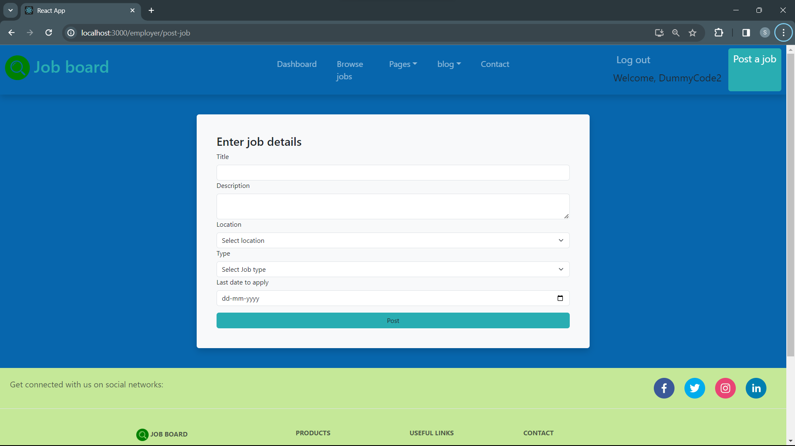

## Prerequisites
* MongoDB
* Node ^10.0.0
* npm

## Run Locally
Install dependencies and start the server
```bash
  cd server
  npm install
  npm start
```

Go to the project directory
```bash
  cd client
  npm install
  npm start
```

# Screenshots
     

[Demo](https://drive.google.com/file/d/1APo4WjKK6E9rIru1HhVtihCBmiG9q-xL/view)
